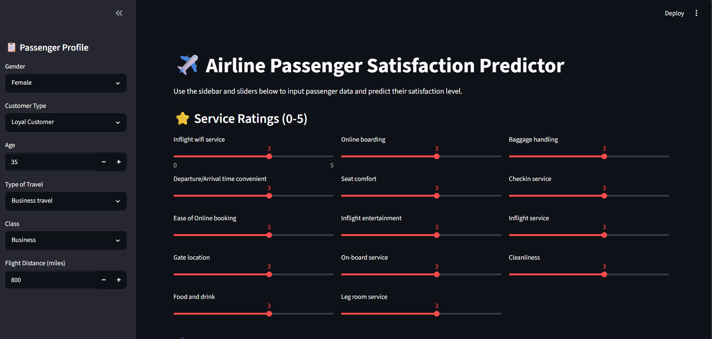
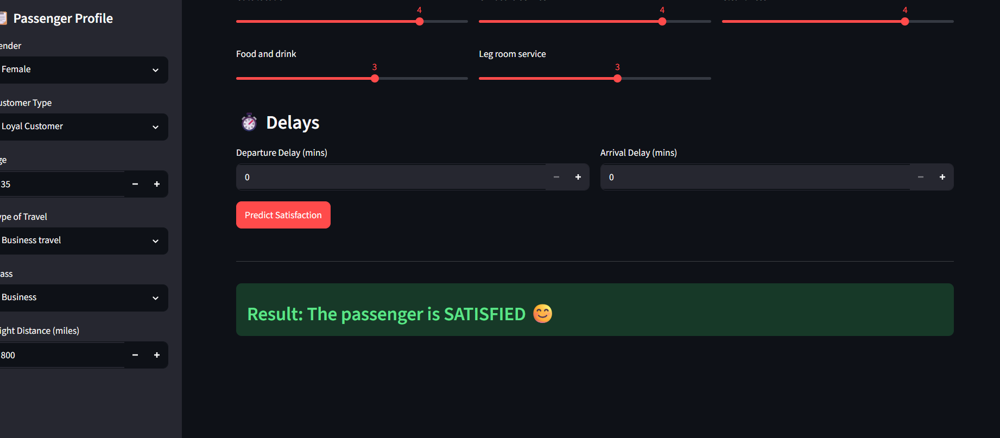

# ✈️ Airline Passenger Satisfaction Predictor

A Machine Learning web application that predicts whether an airline passenger is **Satisfied** or **Neutral/Dissatisfied** based on passenger details, flight information, and service ratings.


---

## 📌 Project Overview

This project uses an **XGBoost Classifier** to predict airline passenger satisfaction using passenger demographics, travel details, service ratings, and delay information.

The model is deployed using **Streamlit**, allowing users to enter passenger details and receive instant predictions through an interactive web interface.

---

## 🚀 Features

- ✈️ Predict airline passenger satisfaction
- 📊 Interactive Streamlit web application
- 🤖 Machine Learning model using XGBoost
- 📈 Feature scaling and label encoding
- ⚡ Instant prediction results
- 🎯 Easy-to-use interface

---

## 🛠️ Technologies Used

- Python
- Streamlit
- Pandas
- NumPy
- Scikit-learn
- XGBoost
- Joblib

---

## 📂 Project Structure

```
Airline-Passenger-Satisfaction-Predictor/
│
├── app.py
├── Airline_Prediction.ipynb
├── README.md
├── requirements.txt
├── home.png
├── satisfied.png
├── ml prjct.csv
├── project org.pkl
├── scaler.pkl
├── le.pkl
├── le1.pkl
├── le2.pkl
└── le3.pkl
```

---

# 📷 Application Screenshots

## 🏠 Home Page



---

## ✅ Prediction Result



---

# ⚙️ Installation

### 1️⃣ Clone the Repository

```bash
git clone https://github.com/Mufliha-CH/Airline-Passenger-Satisfaction-Predictor.git
```

### 2️⃣ Navigate to the Project Folder

```bash
cd Airline-Passenger-Satisfaction-Predictor
```

### 3️⃣ Install Required Packages

```bash
pip install -r requirements.txt
```

### 4️⃣ Run the Streamlit Application

```bash
streamlit run app.py
```

---

# 📊 Machine Learning Workflow

- Data Collection
- Data Cleaning
- Label Encoding
- Feature Scaling
- Model Training
- Model Evaluation
- Model Serialization using Joblib
- Streamlit Deployment

---

# 🤖 Model Information

| Model | XGBoost Classifier |
|--------|--------------------|
| Problem Type | Classification |
| Input Features | 22 |
| Output | Satisfied / Neutral or Dissatisfied |

---

# 📈 Input Features

- Gender
- Customer Type
- Age
- Type of Travel
- Class
- Flight Distance
- Inflight WiFi Service
- Departure/Arrival Time Convenience
- Ease of Online Booking
- Gate Location
- Food and Drink
- Online Boarding
- Seat Comfort
- Inflight Entertainment
- On-board Service
- Leg Room Service
- Baggage Handling
- Check-in Service
- Inflight Service
- Cleanliness
- Departure Delay
- Arrival Delay

---

# 🎯 Future Improvements

- Explain predictions using SHAP
- Probability score for predictions
- Deploy on Streamlit Community Cloud
- Batch prediction from CSV files
- Enhanced UI/UX

---

# 👩‍💻 Author

**Mufliha CH**

🔗 GitHub: https://github.com/Mufliha-CH

🔗 LinkedIn: https://www.linkedin.com/in/mufliha-ch

---

## ⭐ Support

If you found this project useful, please consider giving it a ⭐ on GitHub.

It helps others discover the project and motivates me to build more Machine Learning applications.
